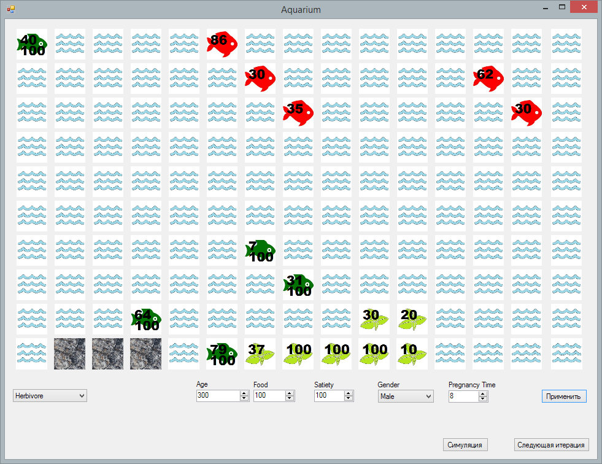

A little aquarium simulation side-project for university, made in the first half of 2017.

Features:
* Aging and reproduction
* Satiety
* Hunting and runaway from/keeping out of hunters
* Extensive usage of my own implementation of Lee pathfinding algorithm for that
* Manual editing of cells by clicking on them and changing the lower fields.

This project was never intended to be something long-lasting or evolving, think of it as a "written-and-forgotten" app. It was more of a proof-of-concept for one of the subjects in the university. Most probably I won't change anything here ever.

